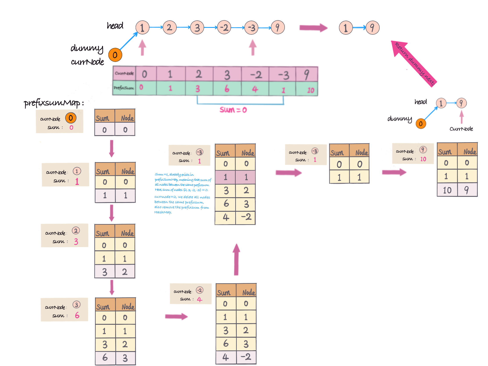

## 题目地址
https://leetcode.com/problems/remove-zero-sum-consecutive-nodes-from-linked-list/

## 题目描述
```
Given the head of a linked list, we repeatedly delete consecutive sequences of nodes that sum to 0 until there are no such sequences.
   
After doing so, return the head of the final linked list.  You may return any such answer.

(Note that in the examples below, all sequences are serializations of ListNode objects.)

Example 1:

Input: head = [1,2,-3,3,1]
Output: [3,1]
Note: The answer [1,2,1] would also be accepted.
Example 2:

Input: head = [1,2,3,-3,4]
Output: [1,2,4]
Example 3:

Input: head = [1,2,3,-3,-2]
Output: [1]

Constraints:

The given linked list will contain between 1 and 1000 nodes.
Each node in the linked list has -1000 <= node.val <= 1000.

```

## 思路
这是一道很典型的求前缀和，如果前缀和出现过，那么相同前缀和之间的元素和为 `0`。

这里可以用`HashMap`， `key`为前缀和，`value`为当前 `Node`，如果前缀和已经在 `HashMap` 中，删除两个相同前缀和之间的所有 `Nodes`，
同时删除 `HashMap` 中对应的前缀和(`prefixSum`) 和 `Node`。 

这里新建一个`dummy node`值为 `0` （如下图例子中所示），相当与初始化 `HashMap`，把 `0` 放入`HashMap`中，遍历`ListNode`，
- 如果`prefixSum`已经出现在`HashMap`中，删除`prefixSum`相同的之间的所有`nodes`, 删除`HashMap`中对应的`prefixSum`  
- 如果`prefixSum` 不在`HashMap` 中，直接把`prefixSum` 和 当前Node 放入`HashMap`中。

举例：`head = [1, 2, 3, -2, -3, 9]`



#### 复杂度分析
- *时间复杂度:* `O(n) - n is number of ListNode`
- *空间复杂度:* `O(n) - HashMap`

## 关键点分析
- 计算前缀和
- 用`HashMap`保存前缀和 和 当前`Node`的mapping
- 初始化`HashMap`，加入` 0` （这里用`dummy node `解决）
- 删除前缀和相同之间的所有`nodes`， 删除`HashMap`中对应的前缀和
- 返回`dummy.next;`.

## 代码 (`Java/Python3`)
*Java Code*
```java
class RemoveZeroInLinkedList {
  public static ListNode removeZeroSumSublists(ListNode head) {
      ListNode dummy = new ListNode(0);
      ListNode currNode = dummy;
      dummy.next = head;
      int prefixSum = 0;
      Map<Integer, ListNode> prefixSumMap = new HashMap<>();
      while (currNode != null) {
        prefixSum += currNode.val;
        // seen prefixSum in HashMap, remove all nodes and relative prefixSum from HashMap
        if (prefixSumMap.containsKey(prefixSum)) {
          currNode = prefixSumMap.get(prefixSum).next;
          int sum = prefixSum + currNode.val;
          while (sum != prefixSum) {
            prefixSumMap.remove(sum);
            currNode = currNode.next;
            sum += currNode.val;
          }
          prefixSumMap.get(prefixSum).next = currNode.next;
        } else {
          // prefixSum not seen in HashMap, add into HashMap
          prefixSumMap.put(prefixSum, currNode);
        }
        currNode = currNode.next;
      }
      return dummy.next;
  }
}
```
*Python3 code*
```python
# Definition for singly-linked list.
# class ListNode:
#     def __init__(self, x):
#         self.val = x
#         self.next = None

class Solution:
    def removeZeroSumSublists(self, head: ListNode) -> ListNode:
        dummy = curr_node = ListNode(0)
        dummy.next = head
        prefix_sum = 0
        prefix_sum_map = {}
        while curr_node:
            prefix_sum += curr_node.val
            if prefix_sum in prefix_sum_map:
                curr_node = prefix_sum_map.get(prefix_sum).next
                sum = prefix_sum + curr_node.val
                while sum != prefix_sum and sum in prefix_sum_map:
                    del prefix_sum_map[sum]
                    curr_node = curr_node.next
                    sum += curr_node.val
                prefix_sum_map[prefix_sum].next = curr_node.next
            else:
                prefix_sum_map[prefix_sum] = curr_node
            curr_node = curr_node.next
        return dummy.next
```
