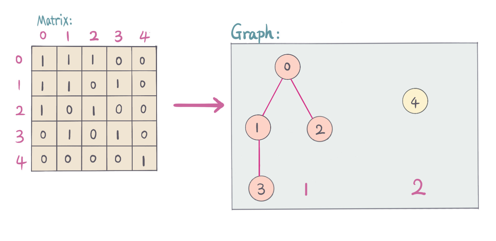
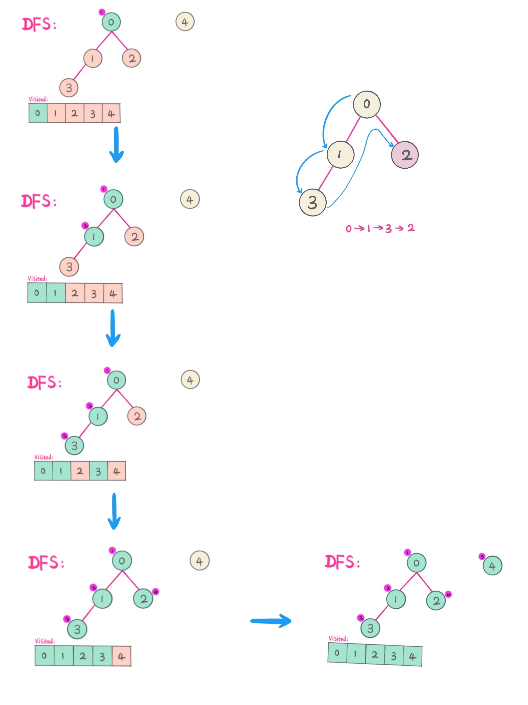
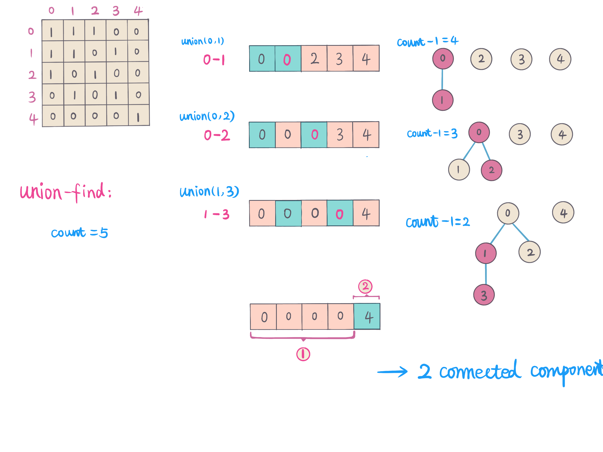

## Problem
https://leetcode.com/problems/friend-circles/

## Problem Description
```
There are N students in a class. Some of them are friends, while some are not. Their friendship is transitive in nature.
For example, if A is a direct friend of B, and B is a direct friend of C, then A is an indirect friend of C.
And we defined a friend circle is a group of students who are direct or indirect friends.

Given a N*N matrix M representing the friend relationship between students in the class.
If M[i][j] = 1, then the ith and jth students are direct friends with each other, otherwise not.
And you have to output the total number of friend circles among all the students.

Example 1:

Input: 
[[1,1,0],
 [1,1,0],
 [0,0,1]]
Output: 2
Explanation:The 0th and 1st students are direct friends, so they are in a friend circle. 
The 2nd student himself is in a friend circle. So return 2.
Example 2:

Input: 
[[1,1,0],
 [1,1,1],
 [0,1,1]]
Output: 1
Explanation:The 0th and 1st students are direct friends, the 1st and 2nd students are direct friends, 
so the 0th and 2nd students are indirect friends. All of them are in the same friend circle, so return 1.
Note:

N is in range [1,200].
M[i][i] = 1 for all students.
If M[i][j] = 1, then M[j][i] = 1.
```

## Solution

We can view a given matrix as [Adjacency Matrix](https://www.wikiwand.com/en/Adjacency_matrix) of a graph. In this case,
this problem become to find number of connected components in a undirected graph.

For example, how to transfer Adjacency Matrix into a graph problem. As below pic:



Connected components in a graph problem usually can be solved using *DFS*, *BFS*, *Union-Find*.

Below we will explain details on each approach. 

#### Approach #1. DFS
1. Do DFS starting from every node, use `visited` array to mark visited node.
2. For each node DFS, visit all its directly connected nodes.
3. For each node DFS, DFS search will search all connected nodes, thus we count one DFS as one connected component.

as below pic show *DFS* traverse process:



#### Complexity Analysis
- *Time Complexity:* `O(n*n) - n is the number of students, traverse n*n matrix`
- *Space Complexity:* `O(n) - visited array of size n`

#### Approach #2. BFS (Level traverse)

1. Start from one node, visit all its directly connected nodes, or visit all nodes in the same level.
2. Use `visited` array to mark already visited nodes. 
3. Increment count when start with a new node.

as below pic show *BFS* (Level traverse) traverse process:


#### Complexity Analysis
- *Time Complexity:* `O(n*n) - n is the number of students, traverse n*n matrix`
- *Space Complexity:* `O(n) - queue and visited array of size n`

#### Approach #3. [Union-Find](https://snowan.github.io/post/union-find/)

Determine number of connected components, Union Find is good algorithm to use.

Use `parent` array, for every node, all its directly connected nodes will be `union`,
so that two connected nodes have the same parent. After traversal all nodes, we just need to calculate 
the number of different values in `parent` array.

For each union, total count minus 1, after traversal and union all connected nodes, simply
return counts. 

Here use **weighted-union-find** to reduce `union` and `find` methods operation time.

To know more details and implementations, see further reading lists. 

as below Union-Find approach process: 



> **Note:** here using weighted-union-find to avoid Union and Find take `O(n)` in the worst case.

#### Complexity Analysis
- *Time Complexity:* `O(n*n*log(n) - traverse n*n matrix, weighted-union-find, union and find takes log(n) time complexity.`
- *Space Complexity:* `O(n) - parent and rank array of size n`

## Key Points
1. Transform Adjacency matrix into Graph
2. Notice that it actually is to find number of connected components problem.
3. Connected components problem approaches (DFS, BFS, Union-Find).

## Code (`Java`)
*Java code* - **DFS**
```java
class FindCirclesDFS {
  public int findCircleNumDFS(int[][] M) {
    if (M == null || M.length == 0 || M[0].length == 0) return 0;
    int n = M.length;
    int numCircles = 0;
    boolean[] visited = new boolean[n];
    for (int i = 0; i < n; i++) {
      if (!visited[i]) {
        dfs(M, i, visited, n);
        numCircles++;
      }
    }
    return countCircle;
  }

  private void dfs(int[][] M, int i, boolean[] visited, int n) {
    for (int j = 0; j < n; j++) {
      if (M[i][j] == 1 && !visited[j]) {
        visited[j] = true;
        dfs(M, j, visited, n);
      }
    }
  }
}
```

*Java code* - **BFS**
```java
class FindCircleBFS {
  public int findCircleNumBFS(int[][] M) {
    if (M == null || M.length == 0) return 0;
    int numCircle = 0;
    int n = M.length;
    boolean[] visited = new boolean[n];
    Queue<Integer> queue = new LinkedList<>();
    for (int i = 0; i < n; i++) {
      // already visited, skip
      if (visited[i]) continue;
      queue.add(i);
      while (!queue.isEmpty()) {
        int curr = queue.poll();
        visited[curr] = true;
        for (int j = 0; j < n; j++) {
          if (M[curr][j] == 1 && !visited[j]) {
            queue.add(j);
          }
        }
      }
      numCircle++;
    }
    return numCircle;
  }
}
```

*Java code* - **Union-Find**
```java
class FindCircleUF {
 public int findCircleNumUF(int[][] M) {
    if (M == null || M.length == 0 || M[0].length == 0) return 0;
    int n = M.length;
    UnionFind uf = new UnionFind(n);
    for (int i = 0; i < n - 1; i++) {
      for (int j = i + 1; j < n; j++) {
        // union friends
        if (M[i][j] == 1) {
          uf.union(i, j);
        }
      }
    }
    return uf.count;
  }
}

class UnionFind {
  int count;
  int[] parent;
  int[] rank;

  public UnionFind(int n) {
    count = n;
    parent = new int[n];
    rank = new int[n];
    for (int i = 0; i < n; i++) {
      parent[i] = i;
    }
  }

  public int find(int a) {
    return parent[a] == a ? a : find(parent[a]);
  }

  public void union(int a, int b) {
    int rootA = find(a);
    int rootB = find(b);
    if (rootA == rootB) return;
    if (rank[rootA] <= rank[rootB]) {
      parent[rootA] = rootB;
      rank[rootB] += rank[rootA];
    } else {
      parent[rootB] = rootA;
      rank[rootA] += rank[rootB];
    }
    count--;
  }

  public int count() {
    return count;
  }
}
```

## References (Further reading)
1. [Adjacency Matrix Wiki](https://www.wikiwand.com/en/Adjacency_matrix)
2. [Union-Find Wiki](https://www.wikiwand.com/en/Disjoint-set_data_structure)
3. [Algorighms 4 union-find](https://www.cs.princeton.edu/~rs/AlgsDS07/01UnionFind.pdf)

## Similar Problems
1. [323. Number of Connected Components in an Undirected Graph](https://leetcode.com/problems/number-of-connected-components-in-an-undirected-graph/)
2. [1101. The Earliest Moment When Everyone Become Friends](https://leetcode.com/problems/the-earliest-moment-when-everyone-become-friends/)
